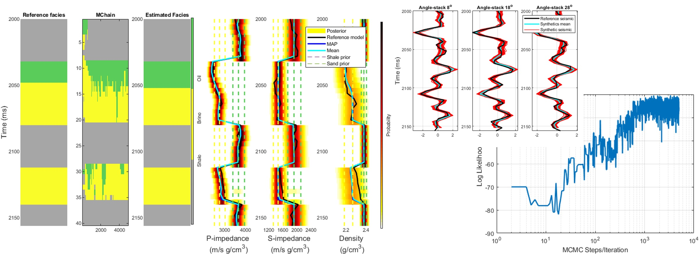
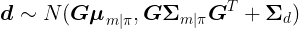

# Gaussian Mixture MCMC - Metropolis

### Gaussian mixture Markov chain Monte Carlo method for linear seismic inversion ###

This algorithm is related to the following publication about joint facies seismic inversion: 

Leandro Passos de Figueiredo, Dario Grana, Mauro Roisenberg, and Bruno B. Rodrigues, (2019), "Gaussian mixture Markov chain Monte Carlo method for linear seismic inversion," GEOPHYSICS 84: R463-R476.
https://doi.org/10.1190/geo2018-0529.1

# Erratum on the article

After a few months of publication we realized that p(d|π) is much simpler than what we have presented in the article. In the code of this repository, one can see how we actually p(d|π) use it in the algorithm.

Because both distributions p(d|m) and p(m|π) are assumed to be Gaussians, p(d|π) is also a Gaussian distribution

### Abstract ###

We have developed a Markov chain Monte Carlo (MCMC) method for joint inversion of seismic data for the prediction of facies and elastic properties. The solution of the inverse problem is defined by the Bayesian posterior distribution of the properties of interest. The prior distribution is a Gaussian mixture model, and each component is associated to a potential configuration of the facies sequence along the seismic trace. The low frequency is incorporated by using facies-dependent depositional trend models for the prior means of the elastic properties in each facies. The posterior distribution is also a Gaussian mixture, for which the Gaussian component can be analytically computed. However, due to the high number of components of the mixture, i.e., the large number of facies configurations, the computation of the full posterior distribution is impractical. Our Gaussian mixture MCMC method allows for the calculation of the full posterior distribution by sampling the facies configurations according to the acceptance/rejection probability. The novelty of the method is the use of an MCMC framework with multimodal distributions for the description of the model properties and the facies along the entire seismic trace. Our method is tested on synthetic seismic data, applied to real seismic data, and validated using a well test.

### New Application ###

Run the file main_synthetic_test.m and see it running with a synthetic dataset.

The repository is organized as follows:

Lane Detection Solution at SAL
We are now repurposing this Gaussian Mixture MCMC algorithm for our lane detection solution at SAL. The core principles of handling multimodal distributions and sampling techniques will enhance our ability to detect and analyze lane patterns accurately. This innovative application demonstrates the algorithm's versatility beyond its initial seismic inversion context.

Multimodal Distributions for Lane Detection:

The Gaussian mixture model (GMM) used in seismic inversion to represent multiple facies sequences can similarly represent different lane configurations and patterns in our lane detection system.
This approach allows us to model complex lane structures, including multiple lanes, lane shifts, and merging lanes, accurately reflecting real-world driving conditions.
Sampling Techniques for Enhanced Accuracy:

The MCMC sampling techniques enable our system to handle a large number of potential lane configurations efficiently.
By sampling from the posterior distribution of lane configurations, our algorithm can provide robust and accurate lane detection even in challenging scenarios, such as poor visibility or complex road layouts.
Bayesian Framework for Uncertainty Quantification:

The Bayesian framework inherent in the Gaussian Mixture MCMC method allows us to quantify the uncertainty in lane detection.
This means our system can provide not just a single best guess of the lane positions but a probabilistic estimate that highlights areas of higher and lower confidence, enhancing the reliability and safety of our lane detection system.
Integration with Real-Time Data:

Our adaptation of the algorithm incorporates real-time data from vehicle sensors, such as cameras and LIDAR, to continuously update the lane detection model.
This real-time capability ensures that our system can respond dynamically to changes in the driving environment, maintaining accurate lane detection even as conditions evolve.
Validation and Testing:

Similar to its initial application in seismic inversion, our adapted Gaussian Mixture MCMC algorithm is rigorously tested using both synthetic and real-world driving data.
This comprehensive testing ensures that the algorithm performs reliably under a wide range of conditions and scenarios, validating its effectiveness for lane detection.
By leveraging the Gaussian Mixture MCMC algorithm's strengths in handling complex, multimodal distributions and efficiently sampling high-dimensional spaces, we are pioneering a new frontier in lane detection technology. This innovative repurposing underscores the algorithm's versatility and the transformative potential of cross-domain applications.

- *GaussianMixMCMC_metropolis.m:* Main function about the methodology 
- *data:* this folder contains a synthetic dataset used as an example
- *functions:* this folder contains functions with by the method;

